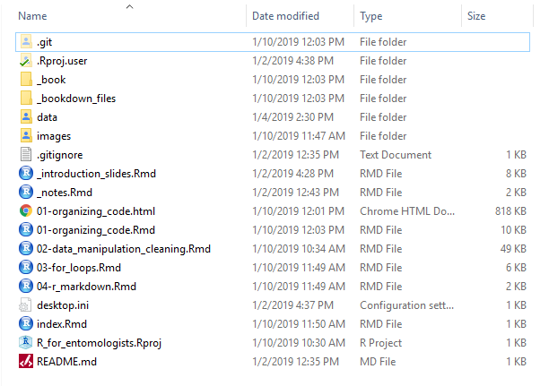

# Organizing Your Work and Your Code

It can be tempting when writing code to be lazy and disorganized. Resist that temptation! Future you will thank you. To help you write more organized code, I'll demonstrate some examples of good and bad code here. I'll also provide some tips and tricks that aren't immediately obvious, and I'll also introduce how to use R projects to help organize not only your code, but also your files.

## Style guides

The first step to writing organized code is to be consistent and the best way to be consistent is to use a style guide.  Style guides are used by large organizations where many people may be working on the same project(s) to make sure their code is consistent. Consistent coding allows people to work more easily with other's code. It can also help you write clearer code for yourself. Here are a few examples:

- [Google's R style guide](https://google.github.io/styleguide/Rguide.xml)
- [Hadley Wickham's R style guide](https://style.tidyverse.org/)
- [Someone else's R style guide](http://jef.works/R-style-guide/)

As an R beginner, you won't understand everything discussed in these style guides so they should be a resource you reference as your R skills grow to see if there's anything you've missed. Pick any style guide that you like best and don't feel the need to follow every single element of the style guide, just make sure you're consistent and deviate in the same way within a single code file. 

I won't spend time going through the details of these style guides but I do want to hilight a few style suggestions that I think are the most important and that you should always follow to make your code more organized and readable.

### Spaces

Use them! Please! Nothing raises my blood pressure more than when I see code like the following bad example:

```{r, eval = FALSE, echo = TRUE}
# Bad = no spaces
ggplot(data,aes(x=x_variable,y=_yvariable))+geom_point(aes(colour=site))

# Good = spaces
ggplot(data, aes(x = x_variable, y = y_variable)) + 
   geom_point(aes(colour = site))
```

The first example is so hard to read! WouldyouwanttoreadthisdocumentifIwroteeverythinglikethis? I bet you wouldn't. Use spaces. Check out one of the style guides to see when you should use spaces.

### Long lines of code

You should avoid writing a line of code that is longer than 80 characters. There are several reasons for this:

- Per [Hadley Wickham](https://style.tidyverse.org/syntax.html#object-names), 80 characters per line fits on a printed page.
- If your code is longer than 80 characters, you may be trying to do too much at once, like nesting 3 or more functions within one another. 80 characters serves as a good benchmark to keep your code simple.
- Long lines of code may require sideways screen scrolling, which is annoying. Imagine trying to read a book written so you had to read the first line of every page, then the second line of every page, and so on.
- Sometimes code within a single function may require more than 80 characters. Spreading this code over multiple lines rather than containing it in one line enhances readability.

How do you know if your code goes over 80 characters? Rstudio has a neat feature you can turn on that puts a little bar in your script window showing you where 80 characters is. To turn on this feature, go to the "Tools" dropdown menu and click "Global Options". From there, click the "Code" section on the left. Then click on the "Display" tab and check the "Show margin" box and set the "margin column" to 80.

The spacing example from above provides an example of spreading a long line of code out over multiple lines.

```{r, eval = FALSE, echo = TRUE}
# Bad = this time there are spaces, but the code is too long (just barely)
ggplot(data, aes(x = x_variable, y = y_variable)) + geom_point(aes(colour = site))

# Good = multiple lines
ggplot(data, aes(x = x_variable, y = y_variable)) + 
   geom_point(aes(colour = site))
```

How do you know where to split lines of code? Split your code among lines so it reads in a uniform way and at least tries to follow a pattern. Keep in mind that when splitting up long lines of code, indenting is your friend. Use indents to make your code line up in ways that are sensible and make it easier to read.  Here are a few examples, it's not important you understand what the code is doing but just pay attention to the patterns (or lack thereof) of dividing up the lines of code.

```{r, eval = FALSE, echo = TRUE}
# Bad = no consistent pattern for splitting code between lines, also goes over
# 80 characters on occasion.
ggplot(data=dat2016, aes(m_total_path)) + geom_histogram(fill="white", colour="black") + facet_grid(treat_id ~ .) +
  theme_bw() + theme(panel.grid.major = element_blank(),
                     panel.grid.minor = element_blank(), axis.line = element_line(colour = "black")) + ggtitle("Total Path Distance") +
  labs(x="Total Path Distance (m)", y="# of Larvae")

# Good = Consistent splitting pattern by starting a new line after each +. Also
# starting a new line after each comma in the theme() function to keep each line
# under 80 characters
ggplot(data = dat2016, aes(m_total_path)) +
   geom_histogram(fill = "white", colour = "black") +
   facet_grid(treat_id ~ .) +
   theme_bw() +
   theme(panel.grid.major = element_blank(),
         panel.grid.minor = element_blank(),
         axis.line = element_line(colour = "black")) +
   ggtitle("Total Path Distance") +
   labs(x = "Total Path Distance (m)", y = "# of Larvae")


# Bad = no consistency, too many nested functions, too long
mean_avg_dist2016 <- as.data.frame(as.list(aggregate(m_total_path ~ treat_id, data=dat2016_movers, 
                                                     FUN = function(x) c(mean = mean(x), n = length(x), se = sd(x)/sqrt(length(x))))))

# Better = consistent line splitting but too many functions nested inside one
# another. Putting closing parenthesis on different lines can help
# compartmentalize code
mean_avg_dist2016 <-
   as.data.frame(
      as.list(
         aggregate(m_total_path ~ treat_id,
                   data = dat2016_movers,
                   FUN = function(x) c(mean = mean(x),
                                       n = length(x),
                                       se = sd(x) / sqrt(length(x)
                                                         )
                                       )
                   )
         )
      )

# Best = Consistent line splitting without nesting too many functions enhances
# readability.
# In the first function aggregate, we give each argument it's own line.
# When specify the custom function to use (FUN = ...), we split each of those
# functions onto their own line. Close paranthesis mark the end of functions
aggregate_data <- aggregate(m_total_path ~ treat_id,
                            data = dat2016_movers,
                            FUN = function(x) c(mean = mean(x),
                                                n = length(x),
                                                se = sd(x) / sqrt(length(x))
                                                )
                            )
# Then we can take what we produced above and use it below, in a readable form.
mean_avg_dist2016 <- as.data.frame(as.list(aggregate_data))
```

In the last example, it made sense for us to make our code more readable by both spreading the code over more vertical space AND adding an intermediate step where we saved the output of one function and then used that output in another. This is what I was referring to above when I said if a line of code is over 80 characters, you might be trying to do too much in that line. The pipe operator, ` %>% ` which is covered elsewhere in this book, is really helpful in preventing this scenario from occurring. 

There are a lot of smaller details to consider that are mentioned in a style guide, like conventions for naming objects and files and such, but we won't get into these here. In this section we took a look at some of the nitty-gritty aspect of code writing but for the next few sections, we're going to zoom out above the code level and talk more generally organizing your files utilizing R projects.

## Organizing your work

### RStudio Projects

Rstudio provides yet another useful feature to help you organize your files and code in neat self-contained folders, called "R Projects". From the [Rstudio website](https://support.rstudio.com/hc/en-us/articles/200526207-Using-Projects), "RStudio projects make it straightforward to divide your work into multiple contexts, each with their own working directory, workspace, history, and source documents." I generally make a separate RStudio project for each work project I'm working on. For example, my Master's thesis had two chapters based on two different sets of experiments that I did. Each of those chapters had their own folder on my harddrive with an RStudio project file in it, which allowed me to easily keep all my data, code, figures, and writing in one location. RStudio projects are especially useful for easily accessing data in code and saving any outputs from your code, because it automatically sets your working directory for you.

You can create a project by going to the File dropdown menu and selecting "New Project". You can create a project along with a new directory (aka folder) or you can put the project file into an existing folder. For these tutorials, I set up a designated folder to hold all the associated files, here's an image of what that directory looks like in Windows Explorer:

```{r, echo = FALSE, fig.cap = "An example of a file directory for an R project.", out.width = '130%'}

```

The second to last file in that image "R_for_entomoloists.Rproj" with the little blue cube is the R Project file. I can open that file which immediately loads an R session and sets my working directory to the folder containing the R project. This makes it relatively painless to load in any other files like code, data, or others without having to remember long file paths. Let's compare how you would read the file "example_buprestid_data.csv" into R without using an R project or a working directory, without using an R project but setting the working directory, and using an R project. (Note: this is all done on a Windows machine, so file paths may look different if you're using a different operating system.)

```{r, eval = FALSE, echo = TRUE}
# Load the example csv file into R without using an R project and without first
# setting the working directory. 

read.csv("C:/Users/wittm094/Google Drive/school_work/grad_school/mini_projects/R_for_entomologists/data/example_buprestid_data.csv")

# Set the working directory first to the directory with all the files and
# relevant subfolders  and then read the csv file into R
setwd("C:/Users/wittm094/Google Drive/school_work/grad_school/mini_projects/R_for_entomologists")
read.csv("data/example_buprestid_data.csv")

# If I use an R project instead and start R by opening the project file, this is
# all the code I need
read.csv("data/example_buprestid_data.csv")
```

Take a moment to create an R project file in a folder for one of your projects.

Using an R project to help organize our work ends up saving us a line of code, since we don't have to specify a working directory and it means we don't have to memorize or find long file directories. The best part of R projects, though, is that it makes it so much easier to share our code! If you send someone the directory containing your R project and all the relevant files, all they have to do is download that directory, open the project file, and R takes care of setting the working directory to be whatever it is on their computer. The other person doesn't need to to go through and change any directory paths, they can open your code and (assuming your code is functional) run it with no problems.

### Organizing your RStudio Project folder

So, now that you have your RStudio project folder set up, how should you organize your files within it to help you stay organized? I generally have one folder for each of the following things: data, R code scripts, manuscript/thesis chapter drafts associated with the project, and figures produced in R for the projects. There might be other folders too, like a "images" folder for pictures from the experiment or field sites. Here's an image of one such directory:

```{r, echo = FALSE, fig.cap = "An example of folders within an R project folder.", out.width = '130%'}
knitr::include_graphics("images/example_folders.png")
```

### Splitting up your code

When you first begin writing code, it can be difficult to come up with a coherent system for organizing your code within a script file and to know how many script files you should use. When I first started, my default was to write incredibly long scripts that loaded the data, cleaned the data, analyzed the data, and visualized the data and not necessarily with any clear flow to the script. It was nearly impossible for me to figure out what I had done or remember where I had done it. 

These days, I like to have one R script for cleaning my data and saving the output as "cleaned_data.csv" and one script for analyzing my data and producing figures. Depending on the number of analyses and figures being produced, that last file could reasonably be split into two. Within a script, I use Rstudio's "Insert section" feature to help organize these files (ctrl/cmd + shift + r). This command will insert text into your R script that breaks it up into sections which you can jump between using the menu at the bottom of the script screen. Here's an example of what I mean (ignore the fact that I didn't follow the 80 character rule. This script was written before I started following that rule.): 

```{r, echo = FALSE, fig.cap = "Using R Studio functionality to split code into chunks that are easy to navigate between.", out.width = '130%'}
knitr::include_graphics("images/example_rcode_sections.png")
```

The menu I have pulled up at the bottom is a list of all the code sections I inserted in bold. If you write custom functions, it also allows me to jump to where those functions were written. You can also see on line 24 of the code where the "Insert Section" feature has inserted a section I named "Data cleaning". The row of "-" following the title make it easy to find code sections when scrolling through your scripts.