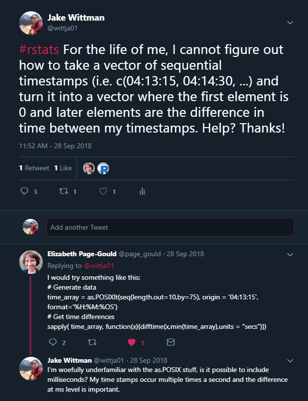
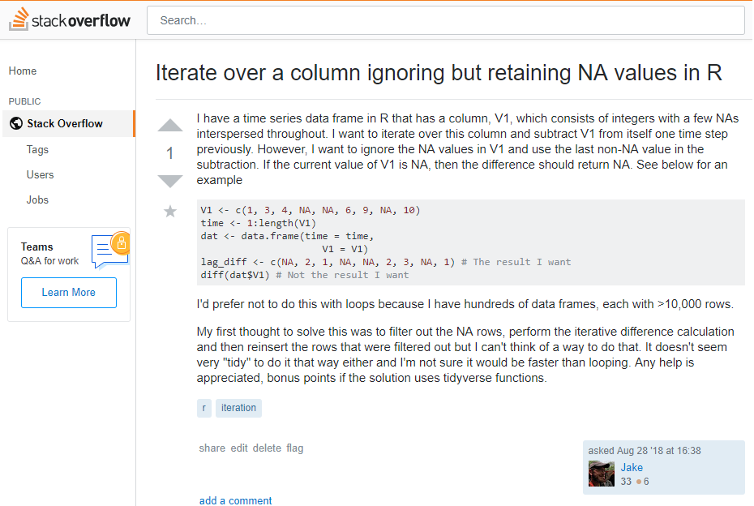
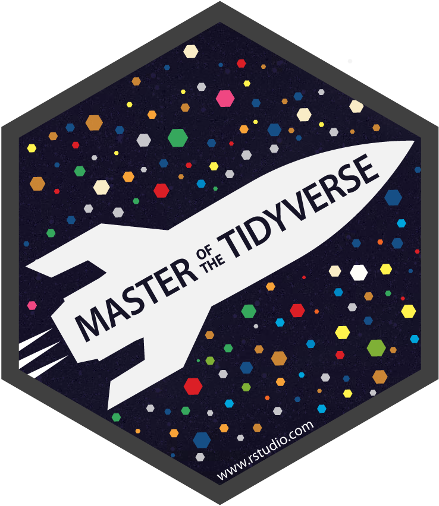

## Goals

Provide a gentle introduction to the world of R focusing on fundamental concepts/skills that you might not get in a stats class.

Emphasis on:

- Reading and writing code
- Data manipulation and cleaning (NOT stats!)
- Brief introduction to R projects and R markdown to make working in R easier

## Why would you want to use R?

<center>


</center>

## Why would you want to use R?

To benefit yourself:

- R can be a massive time saver
- R lets you easily track what you've done previously
- Rstudio has a lot of extra functionality to make managing your projects easier

## Why would you want to use R?

To benefit others:

- Your data cleaning and analysis are integral to your science and R allows others to see EXACTLY what you did.
- Your work can be easily shared and reproduced.

## Why would you want to use another program?

- Data entry (R is not great for data entry)
- You don't have time to learn what you need to


## How much R did I know when I started grad school?

<center>


</center>

## How did I learn more R?

- I started small
- With every project, I picked (at least) one new thing to try to do in R instead of (insert program name here).
- I asked for help.

## How do you learn more R?

<center>


</center>

## What if you don't have any friends?

## What if you don't have any friends?

<center>


</center>

## What if you don't have any friends?

Twitter with the #rstats hashtag

```{r, echo = FALSE, fig.align = "center", out.height = "100%"}

```

## What if you don't have any friends?

StackOverflow

```{r, echo = FALSE, fig.align = "center", out.height = "100%"}

```

## What if you don't have any friends?

Google your task/problem. (But this can be hard if you don't know the right thing to google.)

Read the help files for a function: ?mean (This may also be difficult, many function help pages are not written to be understood by novices.)

## R makes me scared/anxious/nervous/feel stupid

Learning to use R is not easy! You are not the first person to feel this way and you will not be the last. 

## R makes me scared/anxious/nervous/feel stupid

<center>


</center>

## R makes me scared/anxious/nervous/feel stupid

<center>


</center>

## R makes me scared/anxious/nervous/feel stupid

<center>


</center>

## R makes me scared/anxious/nervous/feel stupid

<center>


</center>

## What is R?

- R is a language
- R is a data manipulation/cleaning tool
- R is for programming
- R is statistical analysis
- R is for making apps
- R is for data visualization
- R is for reproducible analysis

## What is R

- R is a language
- R is a data manipulation/cleaning tool

## R as a language

<center>
You need to be able to read your code (or someone else's) in order to understand it.

There are rules to writing code, just like there are rules for writing in English
</center>

## R as a language| Legibility

Which sentence would you rather read?

The quick brown fox jumped over the lazy dog.

tHeqUi cKbrow nFoxJuMpE Dove RthelAzyDoG]

## R as a language | Legible code


```{r, eval = FALSE, echo = TRUE}
n.total<-n.female+n.male                   
ws.female<-rnorm(n.female,mu.femalews,sigmaws)  
ws.male<-rnorm(n.male,mu.malews,sigmaws)      
ws.total<-c(ws.female,ws.male) 
```

```{r, eval = FALSE, echo = TRUE}
n_total <- n_female + n_male
ws_female <- rnorm(n_female, mu_femalews, sigma_ws)
ws_male <- rnorm(n_male, mu_male_ws, sigma_ws)
ws_total <- c(ws_female, ws_male) 
```

## R as a language | Legible code
```{r, eval = FALSE, echo = TRUE}
ggplot(data=dat2016, aes(m_total_path)) + geom_histogram(fill="white",
colour="black") + facet_grid(treat_id ~ .) +  theme_bw() +
theme(panel.grid.major = element_blank(), panel.grid.minor = element_blank(),
axis.line = element_line(colour = "black")) + ggtitle("Total Path Distance") +
labs(x="Total Path Distance (m)", y="# of Larvae")
```


```{r, eval = FALSE, echo = TRUE}
ggplot(data = dat2016, aes(m_total_path)) +
   geom_histogram(fill = "white", colour = "black") +
   facet_grid(treat_id ~ .) +
   theme_bw() +
   theme(panel.grid.major = element_blank(),
         panel.grid.minor = element_blank(),
         axis.line = element_line(colour = "black")) +
   ggtitle("Total Path Distance") + 
   labs(x = "Total Path Distance (m)", y = "# of Larvae")
```

## R as a language | Style guides

Check out a style guide:

- [Google's R style guide](https://google.github.io/styleguide/Rguide.xml)
- [Hadley Wickham's R style guide](https://style.tidyverse.org/)
- [Someone else's R style guide](http://jef.works/R-style-guide/)

## R as a language | Style guides

But most importantly:

- Don't be lazy! 
- Your most important collaborator is yourself 6 months (or more) from now, and past you doesn't answer emails.
- Be consistent and considerate.
- Use white space! (Line breaks or spaces)

## How are we going to do this?

<center>

With the tidyverse

```{r, echo = FALSE}

```

</center>

## What is the tidyverse?

From the [tidyverse website](https://www.tidyverse.org/): "The tidyverse is an opinionated collection of R packages designed for data science. All packages share an underlying design philosophy, grammar, and data structures."

## What is the Tidyverse?

<center>

All packages share an underlying design philosophy, grammar, and data structures.

</center>

This is the most important part and the reason why I recommend learning R through the tidyverse lens.

## A brief history of R

- Open source statistical programming language released in 2000.
- "Base R" is the foundation of the R language and is what you install when you first install R.
- Base R is very powerful and you could do almost everything we will do in Base R.

## So why aren't we going to emphasize Base R?

- While powerful it is not the most intuitive, especially to beginners.
- Base R functions can promote sloppy programming practices.
- Base R has been built over many years by different people without necessarily following a strict design philosophy.
- Some functions may not play well with others.
- Inconsistent design increases intellectual overhead.

## Why Tidyverse?

- The Tidyverse team has focused on developing tools with a consistent design philosophy.
- Consistent design lowers the intellectual overhead required while coding.
- Designed around the idea of functional programming.
- Designed around the idea that code needs to be human readable first and computer readable second.


